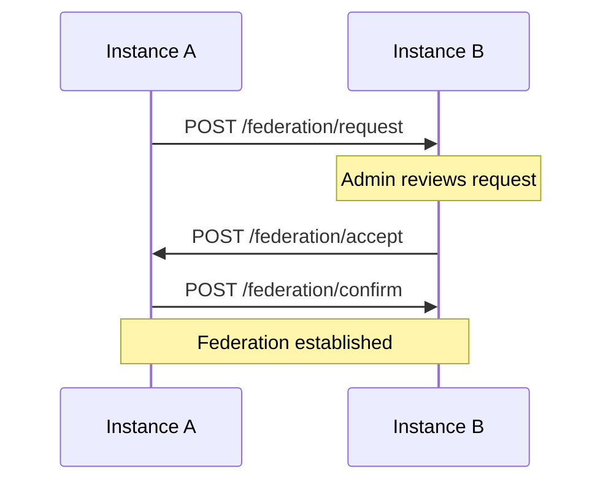
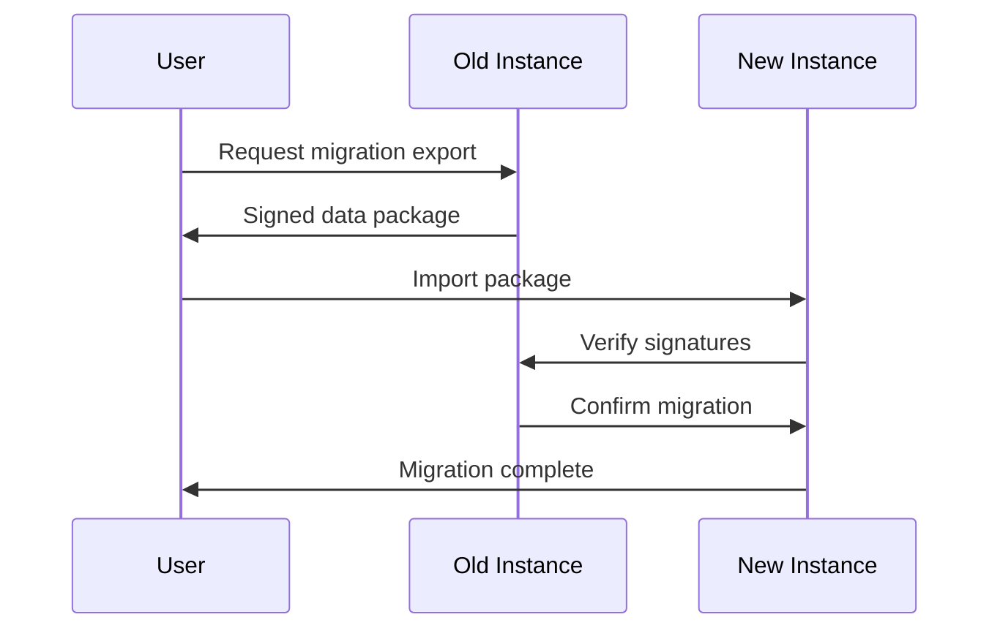
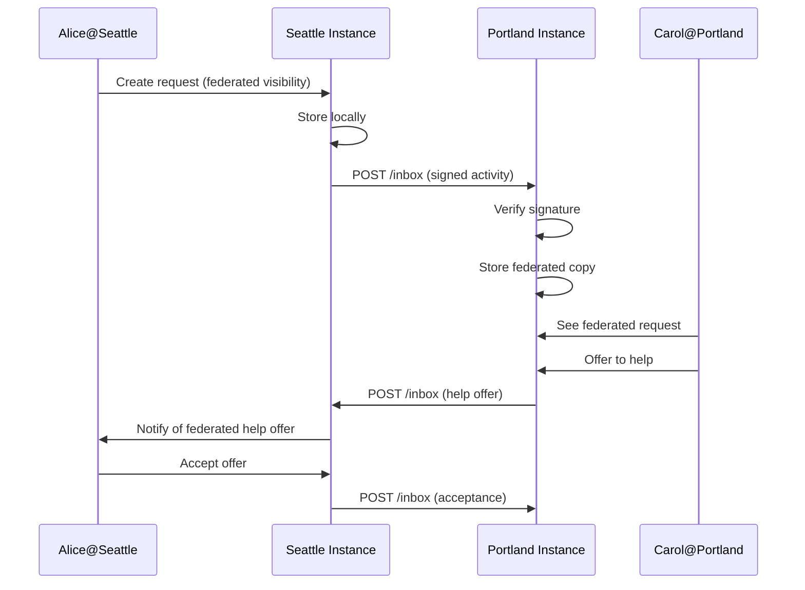

# KarmyQ Federation Protocol (KFP)

**Version:** 0.1.0
**Status:** Draft
**Philosophy:** Distributed mutual aid with local autonomy

## Table of Contents

1. [Core Principles](#core-principles)
2. [Architecture Overview](#architecture-overview)
3. [Instance Identity & Discovery](#instance-identity--discovery)
4. [Trust & Federation](#trust--federation)
5. [Data Models](#data-models)
6. [API Endpoints](#api-endpoints)
7. [User Identity](#user-identity)
8. [Community Federation](#community-federation)
9. [Help Request Federation](#help-request-federation)
10. [Reputation Portability](#reputation-portability)
11. [Security & Privacy](#security--privacy)
12. [Implementation Roadmap](#implementation-roadmap)

---

## Core Principles

### 1. **Local Sovereignty**
- Each instance has complete control over its data
- Communities decide which instances to federate with
- No central authority can override local decisions

### 2. **Consent-Based Federation**
- Federation is opt-in, not default
- Communities explicitly choose federation partners
- Users consent to cross-instance visibility

### 3. **Trust Through Transparency**
- Open protocol, auditable code
- Clear data sharing policies
- Cryptographic verification of federated data

### 4. **Anti-Enshittification**
- No data lock-in (portable user identities)
- No surveillance capitalism (privacy-first)
- No extractive economics (mutual aid, not profit)

### 5. **Progressive Enhancement**
- Works perfectly as standalone instance
- Federation adds value, doesn't create dependency
- Graceful degradation when federation fails

---

## Architecture Overview

```
┌─────────────────────────────────────────────────────────────┐
│                      Instance A (Seattle)                   │
│  ┌──────────────┐  ┌──────────────┐  ┌──────────────┐      │
│  │ Communities  │  │    Users     │  │   Requests   │      │
│  │ - Capitol    │  │ - alice@sea  │  │ - Help with  │      │
│  │   Hill       │  │ - bob@sea    │  │   gardening  │      │
│  └──────────────┘  └──────────────┘  └──────────────┘      │
│           ▲                                                  │
│           │ Federation API (KFP)                            │
└───────────┼──────────────────────────────────────────────────┘
            │
            │ HTTPS + Signed Payloads
            │
┌───────────┼──────────────────────────────────────────────────┐
│           ▼                                                   │
│                     Instance B (Portland)                    │
│  ┌──────────────┐  ┌──────────────┐  ┌──────────────┐       │
│  │ Communities  │  │    Users     │  │   Requests   │       │
│  │ - Eastside   │  │ - carol@pdx  │  │ - Need ride  │       │
│  │   Neighbors  │  │ - dave@pdx   │  │   to clinic  │       │
│  └──────────────┘  └──────────────┘  └──────────────┘       │
└──────────────────────────────────────────────────────────────┘
```

### Key Concepts

- **Instance**: A self-hosted KarmyQ deployment (e.g., `seattle.karmyq.org`)
- **Home Instance**: Where a user's account is registered
- **Federated Instance**: Another instance your home instance trusts
- **Federation Link**: Bidirectional trust relationship between instances
- **Federated User**: User from another instance visible on your instance
- **Federated Request**: Help request visible across instances

---

## Instance Identity & Discovery

### Instance Profile

Each instance has a public profile:

```json
{
  "instance_id": "uuid-v4",
  "domain": "seattle.karmyq.org",
  "name": "Seattle Mutual Aid Network",
  "description": "Mutual aid coordination for Seattle metro area",
  "location": {
    "city": "Seattle",
    "region": "WA",
    "country": "US",
    "coordinates": [47.6062, -122.3321]
  },
  "admin_contact": "admin@seattle.karmyq.org",
  "public_key": "-----BEGIN PUBLIC KEY-----...",
  "created_at": "2025-01-01T00:00:00Z",
  "version": "1.0.0",
  "software": "KarmyQ",
  "federation_policy": {
    "open_registration": true,
    "accepts_federated_requests": true,
    "accepts_federated_users": true,
    "requires_approval": true,
    "trust_model": "community-curated"
  },
  "statistics": {
    "users_count": 1250,
    "communities_count": 45,
    "active_requests_count": 89
  }
}
```

### Discovery Mechanism

#### 1. **Well-Known Endpoint**
```
GET https://seattle.karmyq.org/.well-known/karmyq
```

Returns instance profile (cached for 24h).

#### 2. **Instance Registry (Optional)**
- Community-maintained list of known instances
- Not required for federation (peer-to-peer discovery works)
- Helps with initial discovery

#### 3. **WebFinger** (Future)
```
GET https://seattle.karmyq.org/.well-known/webfinger?resource=acct:alice@seattle.karmyq.org
```

Returns user's federated identity info.

---

## Trust & Federation

### Federation Models

#### Model 1: **Open Federation** (Default)
- Any instance can send requests
- Community moderators can block problematic instances
- Similar to email

#### Model 2: **Allowlist Federation**
- Only explicitly approved instances can federate
- Higher trust, lower reach
- Suitable for sensitive communities

#### Model 3: **Community-Curated**
- Each community decides federation policy
- Some communities open, some closed
- Maximum flexibility

### Establishing Federation



#### Step 1: Request Federation

```http
POST https://portland.karmyq.org/api/v1/federation/request
Authorization: Bearer <instance-token>
Content-Type: application/json

{
  "requesting_instance": "seattle.karmyq.org",
  "public_key": "-----BEGIN PUBLIC KEY-----...",
  "reason": "Geographic proximity, shared values",
  "contact_email": "admin@seattle.karmyq.org",
  "policies": {
    "share_public_requests": true,
    "allow_user_migration": true,
    "respect_blocks": true
  }
}
```

#### Step 2: Accept Federation

```http
POST https://seattle.karmyq.org/api/v1/federation/accept
Authorization: Bearer <instance-token>
Content-Type: application/json

{
  "accepting_instance": "portland.karmyq.org",
  "public_key": "-----BEGIN PUBLIC KEY-----...",
  "federation_id": "uuid-v4",
  "agreed_policies": { /* ... */ }
}
```

#### Step 3: Mutual Verification

Both instances verify each other's public keys and store the federation relationship.

---

## Data Models

### Federated User Identity

```json
{
  "federated_id": "alice@seattle.karmyq.org",
  "local_id": "uuid-on-home-instance",
  "display_name": "Alice",
  "avatar_url": "https://seattle.karmyq.org/avatars/alice.jpg",
  "home_instance": "seattle.karmyq.org",
  "public_profile": {
    "bio": "Community gardener, loves helping neighbors",
    "skills": ["gardening", "carpentry", "cooking"],
    "joined_at": "2024-06-15T00:00:00Z"
  },
  "federated_reputation": {
    "karma_score": 150,
    "trust_level": "established",
    "helps_completed": 42,
    "communities_count": 3,
    "verification_signature": "...",
    "verified_at": "2025-01-10T12:00:00Z"
  }
}
```

### Federated Help Request

```json
{
  "request_id": "uuid-v4",
  "federated_id": "req_abc123@seattle.karmyq.org",
  "origin_instance": "seattle.karmyq.org",
  "requester": {
    "federated_id": "alice@seattle.karmyq.org",
    "display_name": "Alice"
  },
  "community": {
    "federated_id": "capitol-hill@seattle.karmyq.org",
    "name": "Capitol Hill Mutual Aid"
  },
  "title": "Need help moving furniture",
  "description": "Moving to new apartment, need help with couch and bed frame",
  "category": "moving",
  "urgency": "medium",
  "location": {
    "city": "Seattle",
    "neighborhood": "Capitol Hill",
    "coordinates": [47.6205, -122.3212]
  },
  "visibility": "federated",
  "created_at": "2025-01-10T10:00:00Z",
  "expires_at": "2025-01-15T10:00:00Z",
  "signature": "..."
}
```

---

## API Endpoints

### Instance Management

```http
GET    /api/v1/instance/profile
GET    /api/v1/instance/statistics
GET    /api/v1/instance/federation/status
```

### Federation Management

```http
POST   /api/v1/federation/request          # Request federation
POST   /api/v1/federation/accept           # Accept federation
POST   /api/v1/federation/reject           # Reject federation
DELETE /api/v1/federation/:instance_id     # Unfederate
GET    /api/v1/federation/list             # List federated instances
GET    /api/v1/federation/:instance_id     # Get federation details
```

### Federated Content

```http
GET    /api/v1/federated/users/:federated_id
GET    /api/v1/federated/communities
GET    /api/v1/federated/requests
POST   /api/v1/federated/requests/:id/respond  # Respond to federated request
```

### Push Notifications (ActivityPub-style)

```http
POST   /api/v1/inbox                       # Receive federated activities
POST   /api/v1/outbox                      # Send federated activities
```

---

## User Identity

### Federated User Format

```
username@instance.domain
alice@seattle.karmyq.org
```

### User Migration (Portable Identity)

Users can migrate between instances while preserving:
- Identity proof (cryptographic)
- Reputation history (signed attestations)
- Community memberships (with community approval)

#### Migration Process



---

## Community Federation

### Federation Modes for Communities

1. **Local Only**: Not visible to other instances
2. **Discoverable**: Visible but can't accept federated members
3. **Federated**: Accepts members from trusted instances
4. **Open**: Accepts members from any federated instance

### Cross-Instance Community Membership

```json
{
  "community_id": "capitol-hill@seattle.karmyq.org",
  "member": {
    "federated_id": "carol@portland.karmyq.org",
    "status": "active",
    "role": "member",
    "joined_at": "2025-01-05T00:00:00Z",
    "approved_by": "bob@seattle.karmyq.org"
  }
}
```

---

## Help Request Federation

### Request Visibility Levels

1. **Private**: Community members only
2. **Community**: All members + explicitly invited users
3. **Instance**: All users on home instance
4. **Federated**: All users on federated instances
5. **Public**: Publicly viewable (no login required)

### Federated Request Workflow



### Activity Types

```json
{
  "type": "Create",
  "actor": "alice@seattle.karmyq.org",
  "object": {
    "type": "HelpRequest",
    "id": "req_abc123@seattle.karmyq.org",
    "content": { /* request details */ }
  },
  "to": ["https://portland.karmyq.org/actors/instance"],
  "published": "2025-01-10T10:00:00Z",
  "signature": { /* ... */ }
}
```

```json
{
  "type": "Offer",
  "actor": "carol@portland.karmyq.org",
  "object": "req_abc123@seattle.karmyq.org",
  "content": {
    "message": "I can help! I have a truck and free time Saturday.",
    "availability": ["2025-01-13T09:00:00Z", "2025-01-13T17:00:00Z"]
  },
  "published": "2025-01-10T12:00:00Z",
  "signature": { /* ... */ }
}
```

---

## Reputation Portability

### Challenge: Trust Across Instances

Different instances may have different trust models. How do we represent reputation in a federated context?

### Solution: Signed Reputation Attestations

```json
{
  "subject": "alice@seattle.karmyq.org",
  "attestor": "seattle.karmyq.org",
  "attestation": {
    "karma_score": 150,
    "trust_level": "established",
    "helps_completed": 42,
    "helps_received": 38,
    "communities": 3,
    "member_since": "2024-06-15T00:00:00Z",
    "calculated_at": "2025-01-10T00:00:00Z"
  },
  "signature": "...",
  "public_key": "..."
}
```

### Trust Score Interpretation

Each instance can interpret federated reputation differently:

- **Optimistic**: Accept home instance scores at face value
- **Conservative**: Apply discount factor to federated scores
- **Community-Based**: Let community moderators vouch for federated users
- **Progressive**: Start federated users at lower trust, increase with local activity

### Reputation Migration

When a user migrates instances, they carry signed attestations from their previous instance(s).

---

## Security & Privacy

### 1. **Cryptographic Signatures**

All federated activities are signed with instance private keys:

```javascript
const payload = {
  type: "Create",
  actor: "alice@seattle.karmyq.org",
  object: { /* ... */ },
  timestamp: Date.now()
};

const signature = sign(payload, instancePrivateKey);
```

### 2. **Request Authentication**

```http
POST /api/v1/inbox
X-Instance-Domain: seattle.karmyq.org
X-Signature: <base64-signature>
X-Timestamp: 1641849600000
```

Receiving instance verifies:
1. Signature matches payload
2. Public key matches instance domain
3. Timestamp within acceptable window (5 minutes)

### 3. **User Privacy Controls**

Users control what's shared across instances:

```json
{
  "privacy_settings": {
    "profile_visibility": "federated",      // local | federated | public
    "activity_visibility": "federated",
    "reputation_visibility": "federated",
    "allow_federated_requests": true,
    "blocked_instances": ["spam.example.com"]
  }
}
```

### 4. **Instance Blocking**

Communities and instances can block problematic instances:

```sql
CREATE TABLE federation.blocked_instances (
  id UUID PRIMARY KEY,
  instance_domain VARCHAR(255) NOT NULL,
  blocked_by_instance BOOLEAN DEFAULT false,  -- Instance-wide block
  blocked_by_community UUID,                   -- Community-specific block
  reason TEXT,
  blocked_at TIMESTAMP DEFAULT CURRENT_TIMESTAMP
);
```

### 5. **Data Retention**

Federated content can be deleted:

```json
{
  "type": "Delete",
  "actor": "alice@seattle.karmyq.org",
  "object": "req_abc123@seattle.karmyq.org",
  "published": "2025-01-15T10:00:00Z",
  "signature": "..."
}
```

Receiving instances must honor deletion requests.

---

## Implementation Roadmap

### Phase 1: Foundation (Weeks 1-2)
- [ ] Instance identity & keypair generation
- [ ] Well-known endpoint
- [ ] Instance profile API
- [ ] Federation request/accept workflow
- [ ] Database schema for federated content

### Phase 2: Basic Federation (Weeks 3-4)
- [ ] Inbox/outbox endpoints
- [ ] Activity signing & verification
- [ ] Federated user profiles
- [ ] Federated help requests (read-only)

### Phase 3: Interactive Federation (Weeks 5-6)
- [ ] Cross-instance help offers
- [ ] Federated messaging
- [ ] Reputation attestations
- [ ] User migration

### Phase 4: Advanced Features (Weeks 7-8)
- [ ] Community federation controls
- [ ] Instance blocking
- [ ] Moderation tools
- [ ] Analytics & monitoring

### Phase 5: Polish & Security (Weeks 9-10)
- [ ] Security audit
- [ ] Rate limiting
- [ ] Spam prevention
- [ ] Documentation

---

## Example User Flows

### Flow 1: Cross-Instance Help

1. **Alice** (seattle.karmyq.org) posts "Need help moving furniture"
2. Request federated to Portland instance
3. **Carol** (portland.karmyq.org) sees request in her federated feed
4. Carol offers to help (message sent back to Seattle)
5. Alice accepts Carol's offer
6. They coordinate via federated messaging
7. Help completed, both instances record the exchange
8. Reputation updated on both instances

### Flow 2: User Migration

1. **Bob** decides to move from seattle.karmyq.org to portland.karmyq.org
2. Bob requests migration export from Seattle
3. Seattle generates signed data package (identity, reputation, memberships)
4. Bob uploads package to Portland
5. Portland verifies signatures with Seattle
6. Seattle confirms migration and marks account as migrated
7. Bob's communities are notified of new federated ID
8. Bob's reputation carries over (with Seattle's attestation)

### Flow 3: Community Decides to Federate

1. **Capitol Hill Mutual Aid** community votes to allow federated members
2. Moderator enables "Federated" mode
3. Portland users can now discover and join the community
4. Join requests require moderator approval
5. Approved federated members can participate fully

---

## Open Questions & Future Work

1. **Conflict Resolution**: What happens when instances disagree about a help exchange?
2. **Reputation Decay**: Should federated reputation decay over time?
3. **Privacy Levels**: More granular control over what's federated?
4. **Federation Costs**: How to handle storage/bandwidth costs of federation?
5. **Governance**: How do instances collectively decide on protocol changes?
6. **Spam Prevention**: What mechanisms prevent spam across federation?
7. **Legal Compliance**: How to handle GDPR, local laws across instances?

---

## References & Inspiration

- **ActivityPub**: W3C standard for federated social networks
- **Matrix Protocol**: Federated messaging
- **Scuttlebutt**: Decentralized social network
- **Email (SMTP)**: Original federated communication protocol
- **Mutual Aid Principles**: Dean Spade, Anarchist organizing

---

## Contributing

This protocol is a living document. Community feedback welcome at:
- GitHub: github.com/karmyq/federation-protocol
- Matrix: #karmyq-federation:matrix.org
- Email: federation@karmyq.org

---

**License**: CC0 (Public Domain)
**Maintained by**: KarmyQ Community
**Last Updated**: 2025-01-10
