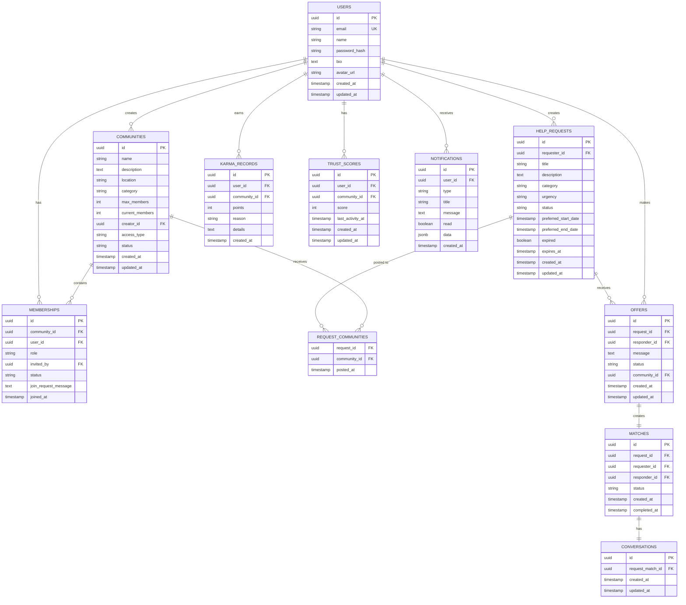

# Karmyq Data Model

**Version**: 6.0.0
**Last Updated**: 2025-12-05
**Database**: PostgreSQL 15

---

## Overview

Karmyq uses a **multi-schema PostgreSQL database** with Row-Level Security (RLS) for data isolation. This document provides a comprehensive overview of the database structure.

### Database Structure

```
karmyq_db
├── auth (2 tables)          - User authentication
├── communities (6 tables)   - Community management
├── requests (4 tables)      - Help requests & matching
├── reputation (4 tables)    - Karma & trust scores
├── notifications (3 tables) - User notifications
├── messaging (3 tables)     - Direct messaging
├── feed (2 tables)          - Activity feed
├── feedback (1 table)       - User feedback
├── governance (3 tables)    - Community governance
└── events (1 table)         - Event log
```

**Total**: 9 schemas, 29 tables

---

## Entity Relationship Diagram

### Core Entities



---

## Schema Details

### 1. Auth Schema

**Purpose**: User authentication and session management

#### auth.users

User accounts for the platform.

| Column | Type | Constraints | Description |
|--------|------|-------------|-------------|
| id | UUID | PK, DEFAULT uuid_generate_v4() | User ID |
| email | VARCHAR(255) | UNIQUE, NOT NULL | Email (login) |
| name | VARCHAR(255) | NOT NULL | Display name |
| password_hash | VARCHAR(255) | NOT NULL | bcrypt hash |
| bio | TEXT | | User bio |
| avatar_url | VARCHAR(255) | | Profile picture URL |
| created_at | TIMESTAMP | DEFAULT NOW() | Account creation |
| updated_at | TIMESTAMP | DEFAULT NOW() | Last update |

**Indexes**:
- `idx_auth_users_email` on `email`

**RLS**: ❌ No (users shared across communities)

#### auth.sessions

JWT session tracking (optional).

| Column | Type | Constraints | Description |
|--------|------|-------------|-------------|
| id | UUID | PK | Session ID |
| user_id | UUID | FK → users(id) | User |
| token | TEXT | UNIQUE, NOT NULL | JWT token |
| expires_at | TIMESTAMP | NOT NULL | Expiration |
| created_at | TIMESTAMP | DEFAULT NOW() | Created |

**Indexes**:
- `idx_auth_sessions_user_id` on `user_id`

**RLS**: ❌ No

---

### 2. Communities Schema

**Purpose**: Community management and membership

#### communities.communities

Communities where users help each other.

| Column | Type | Constraints | Description |
|--------|------|-------------|-------------|
| id | UUID | PK | Community ID |
| name | VARCHAR(255) | NOT NULL | Community name |
| description | TEXT | | Description |
| location | VARCHAR(255) | | Geographic location |
| category | VARCHAR(100) | | Category/type |
| max_members | INTEGER | DEFAULT 150 | Member limit (Dunbar's number) |
| current_members | INTEGER | DEFAULT 0 | Current count |
| creator_id | UUID | FK → users(id) | Creator |
| access_type | VARCHAR(50) | DEFAULT 'public' | public/private |
| status | VARCHAR(50) | DEFAULT 'active' | active/archived |
| created_at | TIMESTAMP | DEFAULT NOW() | Created |
| updated_at | TIMESTAMP | DEFAULT NOW() | Updated |

**Indexes**:
- `idx_communities_creator_id` on `creator_id`
- `idx_communities_location` on `location`
- `idx_communities_category` on `category`
- `idx_communities_status` on `status`

**RLS**: ✅ Membership-based (user must be member)

#### communities.members

Community memberships.

| Column | Type | Constraints | Description |
|--------|------|-------------|-------------|
| id | UUID | PK | Membership ID |
| community_id | UUID | FK → communities(id) | Community |
| user_id | UUID | FK → users(id) | User |
| role | VARCHAR(50) | DEFAULT 'member' | member/moderator/admin |
| invited_by | UUID | FK → users(id), NULL | Inviter |
| status | VARCHAR(50) | DEFAULT 'active' | active/banned/left |
| join_request_message | TEXT | | Message for private communities |
| joined_at | TIMESTAMP | DEFAULT NOW() | Join date |

**Unique**: `(community_id, user_id)`

**Indexes**:
- `idx_members_community_id` on `community_id`
- `idx_members_user_id` on `user_id`

**RLS**: ✅ Membership-based

#### communities.norms

Community guidelines and norms.

| Column | Type | Constraints | Description |
|--------|------|-------------|-------------|
| id | UUID | PK | Norm ID |
| community_id | UUID | FK → communities(id) | Community |
| description | TEXT | NOT NULL | Norm description |
| rationale | TEXT | | Why this norm |
| created_by | UUID | FK → users(id) | Creator |
| status | VARCHAR(50) | DEFAULT 'proposed' | proposed/active |
| created_at | TIMESTAMP | DEFAULT NOW() | Created |
| updated_at | TIMESTAMP | DEFAULT NOW() | Updated |

**Indexes**:
- `idx_norms_community_id` on `community_id`

**RLS**: ✅ Direct `community_id`

#### communities.norm_approvals

Norm approval tracking.

| Column | Type | Constraints | Description |
|--------|------|-------------|-------------|
| id | UUID | PK | Approval ID |
| norm_id | UUID | FK → norms(id) | Norm |
| approved_by | UUID | FK → users(id) | Approver |
| approved_at | TIMESTAMP | DEFAULT NOW() | Approval time |

**Unique**: `(norm_id, approved_by)`

**RLS**: ✅ Junction (via norms)

#### communities.join_requests

Join requests for private communities.

| Column | Type | Constraints | Description |
|--------|------|-------------|-------------|
| id | UUID | PK | Request ID |
| community_id | UUID | FK → communities(id) | Community |
| user_id | UUID | FK → users(id) | Requester |
| message | TEXT | | Request message |
| status | VARCHAR(50) | DEFAULT 'pending' | pending/approved/rejected |
| created_at | TIMESTAMP | DEFAULT NOW() | Requested |
| updated_at | TIMESTAMP | DEFAULT NOW() | Updated |

**RLS**: ✅ Direct `community_id`

#### communities.settings

Per-community configuration.

| Column | Type | Constraints | Description |
|--------|------|-------------|-------------|
| id | UUID | PK | Settings ID |
| community_id | UUID | FK → communities(id), UNIQUE | Community |
| request_ttl_days | INTEGER | DEFAULT 60 | Request expiration |
| offer_ttl_days | INTEGER | DEFAULT 30 | Offer expiration |
| message_ttl_days | INTEGER | DEFAULT 90 | Message expiration |
| notification_ttl_days | INTEGER | DEFAULT 30 | Notification expiration |
| reputation_half_life_months | INTEGER | DEFAULT 6 | Decay half-life |
| created_at | TIMESTAMP | DEFAULT NOW() | Created |
| updated_at | TIMESTAMP | DEFAULT NOW() | Updated |

**RLS**: ✅ Direct `community_id`

---

### 3. Requests Schema

**Purpose**: Help requests, offers, and matching

#### requests.help_requests

Help requests from community members.

| Column | Type | Constraints | Description |
|--------|------|-------------|-------------|
| id | UUID | PK | Request ID |
| requester_id | UUID | FK → users(id) | Requester |
| title | VARCHAR(255) | NOT NULL | Request title |
| description | TEXT | NOT NULL | Details |
| category | VARCHAR(100) | NOT NULL | Category |
| urgency | VARCHAR(50) | DEFAULT 'medium' | low/medium/high/critical |
| status | VARCHAR(50) | DEFAULT 'open' | open/matched/completed/cancelled |
| preferred_start_date | TIMESTAMP | | When help needed |
| preferred_end_date | TIMESTAMP | | Deadline |
| expired | BOOLEAN | DEFAULT false | Soft delete flag |
| expires_at | TIMESTAMP | | Expiration time |
| created_at | TIMESTAMP | DEFAULT NOW() | Created |
| updated_at | TIMESTAMP | DEFAULT NOW() | Updated |

**Indexes**:
- `idx_help_requests_requester_id` on `requester_id`
- `idx_help_requests_status` on `status`
- `idx_help_requests_category` on `category`
- `idx_help_requests_urgency` on `urgency`
- `idx_help_requests_expired` on `expired`

**RLS**: ✅ Junction (via `request_communities`)

#### requests.request_communities

Junction table for multi-community requests.

| Column | Type | Constraints | Description |
|--------|------|-------------|-------------|
| request_id | UUID | FK → help_requests(id) | Request |
| community_id | UUID | FK → communities(id) | Community |
| posted_at | TIMESTAMP | DEFAULT NOW() | When posted |

**Primary Key**: `(request_id, community_id)`

**Indexes**:
- `idx_request_communities_request_id` on `request_id`
- `idx_request_communities_community_id` on `community_id`

**RLS**: ✅ Direct `community_id`

#### requests.help_offers

Offers to help with requests.

| Column | Type | Constraints | Description |
|--------|------|-------------|-------------|
| id | UUID | PK | Offer ID |
| request_id | UUID | FK → help_requests(id) | Request |
| responder_id | UUID | FK → users(id) | Helper |
| message | TEXT | | Offer message |
| status | VARCHAR(50) | DEFAULT 'pending' | pending/accepted/declined |
| community_id | UUID | FK → communities(id) | Community |
| created_at | TIMESTAMP | DEFAULT NOW() | Created |
| updated_at | TIMESTAMP | DEFAULT NOW() | Updated |

**Indexes**:
- `idx_help_offers_request_id` on `request_id`
- `idx_help_offers_responder_id` on `responder_id`
- `idx_help_offers_status` on `status`

**RLS**: ✅ Direct `community_id`

#### requests.matches

Accepted offers (help exchanges).

| Column | Type | Constraints | Description |
|--------|------|-------------|-------------|
| id | UUID | PK | Match ID |
| request_id | UUID | FK → help_requests(id) | Request |
| requester_id | UUID | FK → users(id) | Person needing help |
| responder_id | UUID | FK → users(id) | Helper |
| status | VARCHAR(50) | DEFAULT 'active' | active/completed/cancelled |
| created_at | TIMESTAMP | DEFAULT NOW() | Matched |
| completed_at | TIMESTAMP | | Completed |
| updated_at | TIMESTAMP | DEFAULT NOW() | Updated |

**Indexes**:
- `idx_matches_request_id` on `request_id`
- `idx_matches_requester_id` on `requester_id`
- `idx_matches_responder_id` on `responder_id`
- `idx_matches_status` on `status`

**RLS**: ✅ Junction (via request → `request_communities`)

---

### 4. Reputation Schema

**Purpose**: Karma points, trust scores, badges

#### reputation.karma_records

Karma point transactions.

| Column | Type | Constraints | Description |
|--------|------|-------------|-------------|
| id | UUID | PK | Record ID |
| user_id | UUID | FK → users(id) | User |
| community_id | UUID | FK → communities(id) | Community |
| points | INTEGER | NOT NULL | Points awarded |
| reason | VARCHAR(255) | NOT NULL | Reason code |
| details | TEXT | | Additional details |
| created_at | TIMESTAMP | DEFAULT NOW() | Awarded |

**Indexes**:
- `idx_karma_records_user_id` on `user_id`
- `idx_karma_records_community_id` on `community_id`

**RLS**: ✅ Direct `community_id`

#### reputation.trust_scores

User trust scores per community.

| Column | Type | Constraints | Description |
|--------|------|-------------|-------------|
| id | UUID | PK | Score ID |
| user_id | UUID | FK → users(id) | User |
| community_id | UUID | FK → communities(id) | Community |
| score | INTEGER | DEFAULT 0 | Trust score (0-100) |
| last_activity_at | TIMESTAMP | | Last activity (for decay) |
| created_at | TIMESTAMP | DEFAULT NOW() | Created |
| updated_at | TIMESTAMP | DEFAULT NOW() | Updated |

**Unique**: `(user_id, community_id)`

**Indexes**:
- `idx_trust_scores_user_id` on `user_id`
- `idx_trust_scores_community_id` on `community_id`
- `idx_trust_scores_score` on `score`

**RLS**: ✅ Direct `community_id`

#### reputation.badges

User achievements.

| Column | Type | Constraints | Description |
|--------|------|-------------|-------------|
| id | UUID | PK | Badge ID |
| user_id | UUID | FK → users(id) | User |
| community_id | UUID | FK → communities(id) | Community |
| badge_type | VARCHAR(100) | NOT NULL | Badge type |
| awarded_at | TIMESTAMP | DEFAULT NOW() | Awarded |

**RLS**: ✅ Global (`USING (true)`)

#### reputation.activity_log

User activity tracking for decay reset.

| Column | Type | Constraints | Description |
|--------|------|-------------|-------------|
| id | UUID | PK | Activity ID |
| user_id | UUID | FK → users(id) | User |
| community_id | UUID | FK → communities(id) | Community |
| activity_type | VARCHAR(100) | NOT NULL | Activity type |
| details | JSONB | | Activity data |
| created_at | TIMESTAMP | DEFAULT NOW() | Occurred |

**Indexes**:
- `idx_activity_log_user_id` on `user_id`
- `idx_activity_log_community_id` on `community_id`
- `idx_activity_log_created_at` on `created_at`

**RLS**: ✅ Direct `community_id`

---

### 5. Notifications Schema

**Purpose**: User notifications and preferences

#### notifications.notifications

User notifications.

| Column | Type | Constraints | Description |
|--------|------|-------------|-------------|
| id | UUID | PK | Notification ID |
| user_id | UUID | FK → users(id) | User |
| type | VARCHAR(100) | NOT NULL | Notification type |
| title | VARCHAR(255) | NOT NULL | Title |
| message | TEXT | NOT NULL | Message |
| read | BOOLEAN | DEFAULT false | Read status |
| data | JSONB | | Additional data |
| expires_at | TIMESTAMP | | Expiration |
| created_at | TIMESTAMP | DEFAULT NOW() | Created |

**Indexes**:
- `idx_notifications_user_id` on `user_id`
- `idx_notifications_read` on `read`
- `idx_notifications_type` on `type`

**RLS**: ✅ User-scoped (`user_id`)

#### notifications.preferences

Per-user notification preferences.

| Column | Type | Constraints | Description |
|--------|------|-------------|-------------|
| id | UUID | PK | Preference ID |
| user_id | UUID | FK → users(id) | User |
| channel | VARCHAR(50) | NOT NULL | web/email/mobile |
| type | VARCHAR(100) | NOT NULL | Notification type |
| enabled | BOOLEAN | DEFAULT true | Enabled |
| created_at | TIMESTAMP | DEFAULT NOW() | Created |
| updated_at | TIMESTAMP | DEFAULT NOW() | Updated |

**RLS**: ✅ User-scoped (`user_id`)

#### notifications.global_preferences

Global user notification settings.

| Column | Type | Constraints | Description |
|--------|------|-------------|-------------|
| id | UUID | PK | Preference ID |
| user_id | UUID | FK → users(id), UNIQUE | User |
| email_digest | VARCHAR(50) | DEFAULT 'daily' | Digest frequency |
| push_enabled | BOOLEAN | DEFAULT true | Push notifications |
| created_at | TIMESTAMP | DEFAULT NOW() | Created |
| updated_at | TIMESTAMP | DEFAULT NOW() | Updated |

**RLS**: ✅ User-scoped (`user_id`)

---

### 6. Messaging Schema

**Purpose**: Direct messaging between users

#### messaging.conversations

Conversations (linked to matches).

| Column | Type | Constraints | Description |
|--------|------|-------------|-------------|
| id | UUID | PK | Conversation ID |
| request_match_id | UUID | FK → matches(id), UNIQUE | Match |
| created_at | TIMESTAMP | DEFAULT NOW() | Created |
| updated_at | TIMESTAMP | DEFAULT NOW() | Updated |

**RLS**: ✅ Deep Nested (via match → request → communities)

#### messaging.conversation_participants

Conversation participants.

| Column | Type | Constraints | Description |
|--------|------|-------------|-------------|
| id | UUID | PK | Participant ID |
| conversation_id | UUID | FK → conversations(id) | Conversation |
| user_id | UUID | FK → users(id) | User |
| joined_at | TIMESTAMP | DEFAULT NOW() | Joined |
| last_read_at | TIMESTAMP | | Last read |

**Unique**: `(conversation_id, user_id)`

**RLS**: ✅ Deep Nested (via conversation)

#### messaging.messages

Messages in conversations.

| Column | Type | Constraints | Description |
|--------|------|-------------|-------------|
| id | UUID | PK | Message ID |
| conversation_id | UUID | FK → conversations(id) | Conversation |
| sender_id | UUID | FK → users(id) | Sender |
| content | TEXT | NOT NULL | Message content |
| expires_at | TIMESTAMP | | Expiration |
| created_at | TIMESTAMP | DEFAULT NOW() | Sent |

**Indexes**:
- `idx_messages_conversation_id` on `conversation_id`
- `idx_messages_sender_id` on `sender_id`
- `idx_messages_created_at` on `created_at`

**RLS**: ✅ Deep Nested (via conversation)

---

### 7. Feed Schema

**Purpose**: Activity feed

#### feed.preferences

User feed preferences.

| Column | Type | Constraints | Description |
|--------|------|-------------|-------------|
| id | UUID | PK | Preference ID |
| user_id | UUID | FK → users(id), UNIQUE | User |
| show_types | VARCHAR(100)[] | | Activity types to show |
| created_at | TIMESTAMP | DEFAULT NOW() | Created |
| updated_at | TIMESTAMP | DEFAULT NOW() | Updated |

**RLS**: ✅ User-scoped (`user_id`)

#### feed.dismissed_items

Dismissed feed items.

| Column | Type | Constraints | Description |
|--------|------|-------------|-------------|
| id | UUID | PK | Dismissal ID |
| user_id | UUID | FK → users(id) | User |
| item_type | VARCHAR(100) | NOT NULL | Item type |
| item_id | UUID | NOT NULL | Item ID |
| dismissed_at | TIMESTAMP | DEFAULT NOW() | Dismissed |

**RLS**: ✅ User-scoped (`user_id`)

---

### 8. Feedback Schema

**Purpose**: User feedback

#### feedback.feedback

User-submitted feedback.

| Column | Type | Constraints | Description |
|--------|------|-------------|-------------|
| id | UUID | PK | Feedback ID |
| user_id | UUID | FK → users(id) | User |
| community_id | UUID | FK → communities(id) | Community |
| type | VARCHAR(50) | NOT NULL | bug/feature/other |
| title | VARCHAR(255) | NOT NULL | Title |
| description | TEXT | NOT NULL | Description |
| status | VARCHAR(50) | DEFAULT 'open' | open/reviewed/closed |
| created_at | TIMESTAMP | DEFAULT NOW() | Submitted |

**RLS**: ✅ Direct `community_id`

---

### 9. Governance Schema

**Purpose**: Community governance

#### governance.proposals

Community proposals.

| Column | Type | Constraints | Description |
|--------|------|-------------|-------------|
| id | UUID | PK | Proposal ID |
| community_id | UUID | FK → communities(id) | Community |
| proposed_by | UUID | FK → users(id) | Proposer |
| title | VARCHAR(255) | NOT NULL | Title |
| description | TEXT | NOT NULL | Description |
| status | VARCHAR(50) | DEFAULT 'voting' | voting/passed/rejected |
| created_at | TIMESTAMP | DEFAULT NOW() | Proposed |
| voting_ends_at | TIMESTAMP | | Voting deadline |

**RLS**: ✅ Direct `community_id`

#### governance.votes

Votes on proposals.

| Column | Type | Constraints | Description |
|--------|------|-------------|-------------|
| id | UUID | PK | Vote ID |
| proposal_id | UUID | FK → proposals(id) | Proposal |
| user_id | UUID | FK → users(id) | Voter |
| vote | VARCHAR(50) | NOT NULL | yes/no/abstain |
| voted_at | TIMESTAMP | DEFAULT NOW() | Voted |

**Unique**: `(proposal_id, user_id)`

**RLS**: ✅ Junction (via proposals)

#### governance.conflict_cases

Conflict resolution cases.

| Column | Type | Constraints | Description |
|--------|------|-------------|-------------|
| id | UUID | PK | Case ID |
| community_id | UUID | FK → communities(id) | Community |
| reported_by | UUID | FK → users(id) | Reporter |
| reported_user | UUID | FK → users(id) | Accused |
| description | TEXT | NOT NULL | Issue description |
| status | VARCHAR(50) | DEFAULT 'open' | open/resolved/dismissed |
| resolution | TEXT | | Resolution details |
| created_at | TIMESTAMP | DEFAULT NOW() | Reported |
| resolved_at | TIMESTAMP | | Resolved |

**RLS**: ✅ Direct `community_id`

---

### 10. Events Schema

**Purpose**: Event log (optional)

#### events.event_log

System event log.

| Column | Type | Constraints | Description |
|--------|------|-------------|-------------|
| id | UUID | PK | Event ID |
| event_type | VARCHAR(100) | NOT NULL | Event type |
| entity_type | VARCHAR(100) | NOT NULL | Entity type |
| entity_id | UUID | NOT NULL | Entity ID |
| user_id | UUID | FK → users(id), NULL | Actor |
| data | JSONB | | Event data |
| created_at | TIMESTAMP | DEFAULT NOW() | Occurred |

**Indexes**:
- `idx_event_log_event_type` on `event_type`
- `idx_event_log_entity_type_id` on `(entity_type, entity_id)`
- `idx_event_log_created_at` on `created_at`

**RLS**: ❌ No (global audit log)

---

## Database Functions

### communities.calculate_expires_at

Calculate expiration timestamp based on TTL settings.

```sql
CREATE OR REPLACE FUNCTION communities.calculate_expires_at(
  p_community_id UUID,
  p_entity_type VARCHAR,
  p_created_at TIMESTAMP
) RETURNS TIMESTAMP AS $$
DECLARE
  v_ttl_days INTEGER;
BEGIN
  SELECT
    CASE p_entity_type
      WHEN 'request' THEN request_ttl_days
      WHEN 'offer' THEN offer_ttl_days
      WHEN 'message' THEN message_ttl_days
      WHEN 'notification' THEN notification_ttl_days
      ELSE 60
    END
  INTO v_ttl_days
  FROM communities.settings
  WHERE community_id = p_community_id;

  RETURN p_created_at + (v_ttl_days || ' days')::INTERVAL;
END;
$$ LANGUAGE plpgsql;
```

### reputation.calculate_decayed_karma

Calculate karma with exponential time decay.

```sql
CREATE OR REPLACE FUNCTION reputation.calculate_decayed_karma(
  p_user_id UUID,
  p_community_id UUID
) RETURNS INTEGER AS $$
DECLARE
  v_half_life_months INTEGER;
  v_decayed_karma NUMERIC := 0;
  v_record RECORD;
BEGIN
  -- Get half-life setting
  SELECT reputation_half_life_months INTO v_half_life_months
  FROM communities.settings
  WHERE community_id = p_community_id;

  -- Calculate decayed karma for each record
  FOR v_record IN
    SELECT points, created_at
    FROM reputation.karma_records
    WHERE user_id = p_user_id
      AND community_id = p_community_id
  LOOP
    v_decayed_karma := v_decayed_karma + (
      v_record.points * POWER(0.5,
        EXTRACT(EPOCH FROM (NOW() - v_record.created_at)) / (v_half_life_months * 30.44 * 24 * 60 * 60)
      )
    );
  END LOOP;

  RETURN FLOOR(v_decayed_karma);
END;
$$ LANGUAGE plpgsql;
```

---

## Indexes Summary

### Critical Indexes (Performance)

**Foreign Key Indexes** (all tables):
- Every FK has an index for join performance

**Status Indexes** (filtering):
- `help_requests.status`
- `matches.status`
- `offers.status`
- `communities.status`
- `memberships.status`

**Timestamp Indexes** (sorting):
- `help_requests.created_at`
- `matches.created_at`
- `messages.created_at`
- `activity_log.created_at`

**RLS Performance Indexes**:
- All `community_id` columns indexed
- Junction tables: `(request_id, community_id)`
- Composite indexes for common queries

---

## Data Lifecycle

### Ephemeral Data (TTL)

Tables with expiration:
- `requests.help_requests` (`expires_at`, `expired`)
- `requests.help_offers` (`expires_at`, `expired`)
- `messaging.messages` (`expires_at`)
- `notifications.notifications` (`expires_at`)

**Process**:
1. **Hourly**: Cleanup service marks `expired = true`
2. **Daily (2 AM)**: Hard delete records expired >7 days (grace period)

### Reputation Decay

**Formula**: `karma * 0.5^(months_ago / half_life_months)`

**Process**:
1. **Daily (3 AM)**: Cleanup service recalculates all trust scores
2. Uses `calculate_decayed_karma()` function
3. Updates `reputation.trust_scores.score`

### Activity Tracking

**Purpose**: Reset decay for active users

**Tracked Activities**:
- `complete_request` - Helped someone
- `complete_offer` - Received help

**Process**:
- Updates `trust_scores.last_activity_at`
- Prevents decay for active members

---

## Migrations

### Migration Strategy

**Current**: All schema in `infrastructure/postgres/init.sql`

**Future**: Versioned migrations
```
infrastructure/postgres/migrations/
├── 001_initial_schema.sql
├── 002_add_join_requests.sql
├── 003_add_activity_log.sql
└── ...
```

**Tools**: Consider Flyway, Liquibase, or Node migration tools

---

## Related Documentation

- [RLS Policies](RLS_POLICIES.md) - Complete RLS policy documentation
- [ARCHITECTURE.md](ARCHITECTURE.md#database-schema) - Architecture overview
- [TR-002: Multi-Tenancy](../requirements/technical/TR-002-multi-tenancy.md)
- [TR-004: Row-Level Security](../requirements/technical/TR-004-rls.md)

---

**Last Updated**: 2025-12-05
**Database Version**: PostgreSQL 15
**Total Tables**: 29
**Total Schemas**: 9
**Maintained by**: Karmyq Development Team
