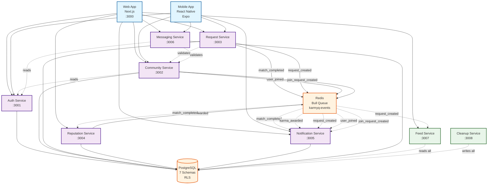

# Service Dependencies

**Version**: 6.0.0
**Last Updated**: 2025-12-05

This document visualizes the dependencies between Karmyq microservices.

---

## Service Dependency Graph



---

## Service Types

### 🎨 Client Applications
- **Web App** (Next.js, Port 3000)
- **Mobile App** (React Native + Expo)

### 🔧 Core Services
Services with dedicated database schemas and standard CRUD operations.

| Service | Port | Purpose | Schema | Dependencies |
|---------|------|---------|--------|--------------|
| **Auth** | 3001 | Authentication, JWT | `auth` | None (foundation) |
| **Community** | 3002 | Communities, memberships | `community` | Auth (user lookups) |
| **Request** | 3003 | Help requests, matches | `requests` | Community (validation) |
| **Reputation** | 3004 | Karma, trust scores | `reputation` | None (event-driven) |
| **Notification** | 3005 | Real-time notifications | `notifications` | None (event-driven) |
| **Messaging** | 3006 | Direct messaging | `messaging` | Auth, Community |

### 🌟 Special Services
Services with cross-schema access or unique responsibilities.

| Service | Port | Purpose | Database Access | Note |
|---------|------|---------|----------------|------|
| **Feed** | 3007 | Activity aggregation | Read-only, all schemas | No writes |
| **Cleanup** | 3008 | Data lifecycle | Write-all, all schemas | Scheduled jobs |

---

## Dependency Details

### Auth Service (Foundation Layer)

```
Auth Service
├─ Dependencies: NONE
├─ Called By: ALL services (JWT verification)
├─ Events: None
└─ Database: auth schema only
```

**Why no dependencies?**
- Foundation of authentication system
- Must be available for all other services
- Self-contained user management

### Community Service

```
Community Service
├─ Dependencies: Auth (user lookups)
├─ Called By: Request, Messaging
├─ Events Published:
│   ├─ user_joined_community
│   └─ join_request_created
└─ Database: community schema
```

**Dependencies explained:**
- **Auth**: Validates user exists before adding to community
- **Called by Request**: Validates community exists for requests
- **Called by Messaging**: Validates users in same community for messages

### Request Service

```
Request Service
├─ Dependencies: Community (validation)
├─ Called By: Frontend only
├─ Events Published:
│   ├─ match_completed
│   └─ request_created
└─ Database: requests schema
```

**Dependencies explained:**
- **Community**: Validates `community_id` exists before creating request
- **Publishes events**: Triggers karma awards and notifications

### Reputation Service

```
Reputation Service
├─ Dependencies: NONE (event-driven)
├─ Called By: Frontend only
├─ Events Consumed:
│   └─ match_completed (award karma)
├─ Events Published:
│   └─ karma_awarded
└─ Database: reputation schema
```

**Why no direct dependencies?**
- Purely event-driven
- Consumes `match_completed` to award karma
- No synchronous calls to other services

### Notification Service

```
Notification Service
├─ Dependencies: NONE (event-driven)
├─ Called By: Frontend only
├─ Events Consumed:
│   ├─ match_completed
│   ├─ karma_awarded
│   ├─ request_created
│   ├─ user_joined_community
│   └─ join_request_created
└─ Database: notifications schema
```

**Special Note:**
- SSE endpoint (`/notifications/stream/:userId`) has no authentication
- All other services authenticate users first

### Messaging Service

```
Messaging Service
├─ Dependencies: Auth, Community
├─ Called By: Frontend only
├─ Events: None currently
└─ Database: messaging schema
```

**Dependencies explained:**
- **Auth**: Lookup user profiles for display
- **Community**: Validate both users in same community (can't message across communities)

### Feed Service (Read-Only)

```
Feed Service
├─ Dependencies: NONE
├─ Called By: Frontend only
├─ Events Consumed: All (for feed population)
├─ Database: Reads all schemas
└─ Special: No database writes
```

**Cross-Schema Queries:**
```sql
-- Feed service joins across schemas
SELECT
  r.title,
  u.name AS requester_name,
  c.name AS community_name
FROM requests.help_requests r
JOIN auth.users u ON r.requester_id = u.id
JOIN community.communities c ON r.community_id = c.id
WHERE r.status = 'open'
ORDER BY r.created_at DESC;
```

### Cleanup Service (Write-All)

```
Cleanup Service
├─ Dependencies: NONE
├─ Called By: Manual triggers only
├─ Events: None
├─ Database: Writes to all schemas
├─ Jobs: Cron-based (hourly, daily, weekly)
└─ Special: RLS disabled for admin operations
```

**Cross-Schema Writes:**
- Marks expired: `requests`, `notifications`, `messaging`
- Hard deletes: All schemas after grace period
- Updates: `reputation.trust_scores` (decay calculation)

---

## Communication Patterns

### 1. Synchronous (REST API)

**Pattern**: Client → Service
```
Frontend
  ├─ POST /register → Auth Service
  ├─ GET /requests → Request Service
  └─ GET /notifications → Notification Service
```

**Pattern**: Service → Service (Rare)
```
Community Service
  └─ GET /users/:id → Auth Service (user lookup)

Request Service
  └─ GET /communities/:id → Community Service (validation)
```

**Why rare?**
- Tight coupling increases failure cascades
- Prefer event-driven for service-to-service

### 2. Asynchronous (Events via Redis/Bull)

**Pattern**: Publisher → Queue → Subscriber(s)

```
Request Service (Publisher)
  └─ publishEvent('match_completed', payload)
      └─ Redis Queue (karmyq-events)
          ├─ Reputation Service → Award karma
          └─ Notification Service → Create notification
```

**Benefits:**
- Loose coupling
- Multiple subscribers
- Retry on failure
- Eventual consistency

### 3. Database-Level (RLS)

**Pattern**: Middleware sets session variable → PostgreSQL filters rows

```
HTTP Request
  └─ authMiddleware (verify JWT)
      └─ tenantMiddleware (extract community_id)
          └─ dbContextMiddleware (SET LOCAL app.current_community_id)
              └─ PostgreSQL RLS Policies (automatic filtering)
```

**Result:** All queries automatically scoped to community!

---

## Event Flow Examples

### Example 1: Help Request Completed

```
1. User marks match as completed (Frontend → Request Service)
   └─ PUT /matches/:id/complete

2. Request Service updates match status
   └─ UPDATE requests.matches SET status = 'completed'

3. Request Service publishes event
   └─ publishEvent('match_completed', {
        match_id, request_id,
        requester_id, responder_id,
        community_id
      })

4. Reputation Service consumes event
   ├─ Award karma to responder (+25 points)
   ├─ Award karma to requester (+10 points)
   ├─ Update trust scores
   └─ publishEvent('karma_awarded', ...)

5. Notification Service consumes events
   ├─ match_completed → "Your help exchange is complete!"
   └─ karma_awarded → "You earned 25 karma points!"

6. Feed Service polls/consumes event
   └─ Add to activity feed for both users
```

### Example 2: New Help Request

```
1. User creates request (Frontend → Request Service)
   └─ POST /requests

2. Request Service creates request
   └─ INSERT INTO requests.help_requests

3. Request Service publishes event
   └─ publishEvent('request_created', {
        request_id, requester_id,
        community_id, title, urgency
      })

4. Notification Service consumes event
   └─ Notify all community members with matching skills

5. Feed Service consumes event
   └─ Add to community activity feed
```

---

## Failure Modes & Resilience

### Service Down Scenarios

#### Auth Service Down
**Impact**: 🔴 **CRITICAL** - All authenticated requests fail
**Mitigation**:
- High availability deployment (multiple instances)
- Health check monitoring with auto-restart
- Consider JWT validation cache (risk vs availability)

#### Community Service Down
**Impact**: 🟡 **MODERATE** - Request creation fails, messages fail
**Degradation**:
- Existing data still accessible (no validation needed)
- Cache community lookups in calling services
**Mitigation**: Circuit breaker pattern, fallback to cached data

#### Request Service Down
**Impact**: 🟡 **MODERATE** - Can't create/view requests
**Degradation**:
- Other features (messaging, reputation) still work
- Events queued in Redis for processing when back
**Mitigation**: Event replay when service recovers

#### Reputation Service Down
**Impact**: 🟢 **LOW** - Karma awards delayed
**Degradation**:
- Events queued in Redis
- Karma awarded when service recovers
**Mitigation**: Bull queue automatically retries

#### Notification Service Down
**Impact**: 🟢 **LOW** - Notifications delayed
**Degradation**:
- Notifications created when service recovers
- SSE connections fail (users need to refresh)
**Mitigation**: Graceful reconnection in frontend

#### Feed Service Down
**Impact**: 🟢 **LOW** - No activity feed
**Degradation**:
- All other features work normally
**Mitigation**: None needed (nice-to-have feature)

#### Cleanup Service Down
**Impact**: 🟢 **VERY LOW** - Data not expired (accumulates)
**Degradation**:
- No immediate impact
- Eventually database grows
**Mitigation**: Manual job triggers

### Database Down
**Impact**: 🔴 **CATASTROPHIC** - All services fail
**Mitigation**:
- Database replication (read replicas)
- Automated backups
- Disaster recovery plan
- Connection pooling with retry

### Redis Down
**Impact**: 🟡 **MODERATE** - Events lost, services still respond
**Degradation**:
- Services work for direct requests
- Notifications delayed
- Karma awards delayed
**Mitigation**:
- Redis persistence (AOF/RDB)
- Redis Sentinel for HA
- Event replay mechanism

---

## Scaling Considerations

### Stateless Services (Easy to Scale)
- **Auth, Community, Request, Reputation, Messaging**
- Can run multiple instances behind load balancer
- No shared state (database is source of truth)

### Stateful Services (Needs Consideration)
- **Notification Service (SSE)**: Requires sticky sessions or Redis pub/sub
- **Cleanup Service**: Single instance with job locks (or distributed locks)

### Database Scaling
- **Read Replicas**: Feed service, stats queries
- **Connection Pooling**: PgBouncer
- **Partitioning**: Large tables by `community_id`

### Event Queue Scaling
- **Redis Cluster**: High availability
- **Multiple Workers**: Scale Bull workers per service

---

## Related Documentation

- [ARCHITECTURE.md](ARCHITECTURE.md) - Complete system architecture
- [DATA_MODEL.md](DATA_MODEL.md) - Database schema details (planned)
- [TR-001: Microservices](../requirements/technical/TR-001-microservices.md)
- [TR-003: Event-Driven Architecture](../requirements/technical/TR-003-events.md)

---

**Last Updated**: 2025-12-05
**Maintained by**: Karmyq Development Team
