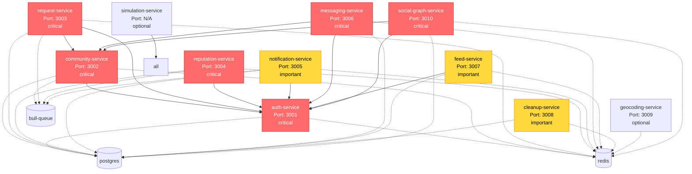

# Service Dependency Graph

**Generated**: 2026-01-22T14:53:22.025Z

## Legend

- 🔴 Red nodes: **Critical** services (system fails if down)
- 🟡 Yellow nodes: **Important** services (degraded experience if down)
- ⚪ White nodes: **Optional** services
- 🔘 Gray nodes: **Deprecated** services
- Solid arrows: Service dependencies
- Dotted arrows: Infrastructure dependencies

